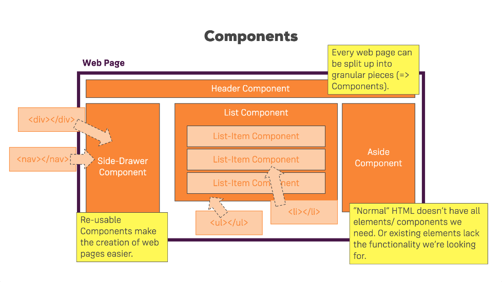

## Getting Started

- **React** is a JS library for building UI's
- React apps run in the browser 
- Things happen instantly because we don't have to wait for a server response. 
- UI's are build using components
	- makes working in teams easier
	- makes our code easy to maintain
	- makes code reusable (DRY)

- React is about writing **Custom HTML Elements**
- Webpages built with React: [Reactjs](https://reactjs.org/), [Udemy](https://www.udemy.com/)
- React: the logic we need for creating React components. 
- React DOM: renders the logic into the real DOM
- Babel: a tool which compiles the next generation JS code we're writing into code that runs fine in the browser. This way we write code with the features we want, but ship code that works in the browser.

##### Things to remember: 

- Single page app: 
	- only get back one single HTML file, everything thereafter is managed by JS, rerendered on Client
	- Our page is built up with component
	- Every component is a React component, and the entire page is managed by a root React component, and under React control
	- Typically only have ONE `ReactDOM.render()` call.
- Multi page app
	- multiple HTML pages, Content is rendered on Server
	- We could split up the page to components, but a lot of the page would be HTML, CSS
	- We could add some React widgets, and then each widget would require one `ReactDOM.render()` call 

All chapter examples are shared on [Codepen](https://codepen.io/collection/DdvzKK/).

### Example 1: 

[Example 1 demo on Codepen](https://codepen.io/hakabuk/pen/oyOQqW)

**file.html**

```
<div id='app'></div>
```

This HTML file contains a single `div` with `id='app'`. Our goal is to use React to fill this `div` with content. 

**file.js**

```
function Person() {
  return (
    <div className='person'>
       <h1>Michal</h1>
        <p>Location: London</p>    
    </div>
  );
}

ReactDOM.render(<Person />, document.querySelector('#app'));
```

Firstly, this JS file is written in JSX syntax. It looks like HTML inside JS, which wouldn't work normally. However, using preprocessors like Babel allows you to use this special syntax. This HTML and JS mix gets compiled into normal JS code. This is just syntactic sugar to make our life easier when writing what we want to render. 

This JS file is responsible to create a reusable component, which is then displayed in the HTML file. It contains two main parts:

- A `Person` function that returns the content of the component
- A `render` method which is responsible to render the function into the HTML div. 

The first part of the code declared a function `Person` which returns an `h1` and `p` elements wrapped inside a `div` with className `person`. Please note that `class` is a keyword in JS, so React needs us to use `className` instead of `class` (one reason to use the class is to allow you to add some style to it, and see how it affects the component display).

The second part of the code renders a JS function as a component into the real DOM. Note we need to reference the function only after turning it into an HTML element by using JSX syntax: `<Person />`. The `render` method takes another argument where we specify where to render the component. We used JS's `querySelector` to locate the div with `id='app'`.

This will work, but it isn't really reusable if we need to hardcode text into `h1` and `p` in each component. 

### Example 2: 

[Example 2 demo on Codepen](https://codepen.io/hakabuk/pen/BVEGEM)

Instead of hard coding the value inside each tag, we can configure components dynamically as we need them using the `props` argument which is paddes into `Person`. 

All we need to do is adjust `Person` component to take an argument which we will call `props`, and pass in attributes when we call the method `render`. This is how it might look if we wanted to use two components:

**file.html**

```
<div id="app1"></div>
<div id="app2"></div>

```
**file.js**

```
function Person(props) {
  return (
    <div className='person'>
       <h1>{props.name}</h1>
        <p>Location: {props.location}</p>    
    </div>
  );
}

ReactDOM.render(<Person name='Michal' location='London' />, document.querySelector('#app'));
```

This time, we're adding in two attributes to `Person`: `name='Michal' location='London'`. Note the syntax looks like HTML syntax. We then need to go into the function `Person` and output the dynamic content using curly braces. `{props.name}` outputs the name attribute, etc. Note that inside the function the syntax resembles JS. 

Now we can run the render function over and over to create additional components on the page, like so: 

```
ReactDOM.render(<Person name='Michal' location='London' />, document.querySelector('#app1'));

ReactDOM.render(<Person name='Elsa' location='Arendelle' />, document.querySelector('#app2'));

```

Note that we'll also need two different div elements inside the HTML file: 

```
<div id='app1'></div>
<div id='app2'></div>
```

This doesn't look ideal, especially if you want to add a large number of reusable pieces. 

### Example 3: 

[Example 3 demo on Codepen](https://codepen.io/hakabuk/pen/RJOEwB)

There is a more efficient way to do this where we only need to call the `render` method once, and we'll only need one container `div` inside the HTML file. 

To do this, we'll only need on div inside the HTML file:

**file.html**

```
<div id='app'></div>
```

**file.js**

```
function Person(props) {
  return (
    <div className='person'>
       <h1>{props.name}</h1>
        <p>Location: {props.location}</p>    
    </div>
  );
}

var app = (
  <div>
    <Person name='Michal' location='London' />
    <Person name='Elsa' location='Arendelle' />
    <Person name='Olaf' location='North Pole' />
  </div>
);

ReactDOM.render(app, document.querySelector('#app'));
```

In the JS file, the `Person` component remains the same. It is only displayed here again for clarity.

We've made two changes in this version of the JS file: 

- Created a variable named `app` that includes a container div with multiple Person components including props.
- We're now padding in the variable `app` rather than pass in an individual component with an individual `Person`'s props. We're passing all at once, and the `render` method displays all three components in the HTML page.

In very big applications we can compose the entire app of reusable pieces. If we were to add logic to these components (and we surely will), we will have small, reusable, maintainable, and easy to manage pieces with their own logic contained in them, that we could use to build apps. 
