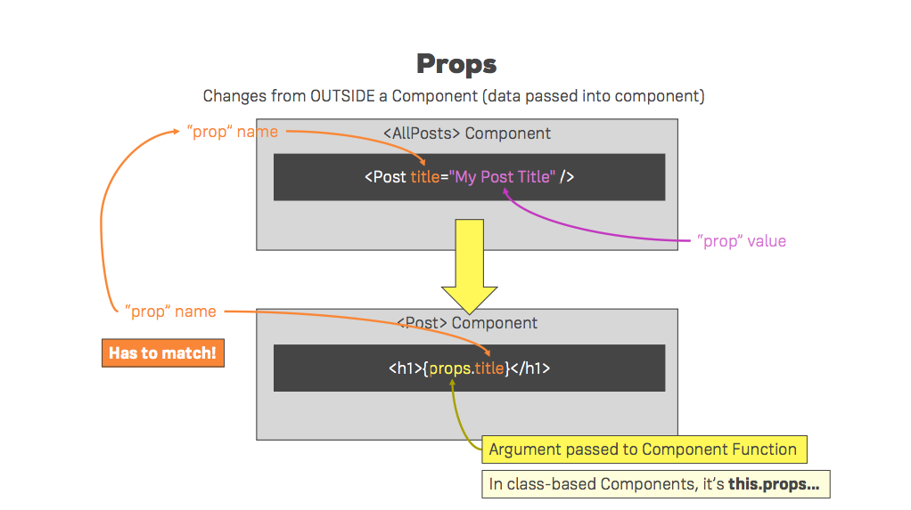

## Base Features & Syntax


### Why use a Build Workflow?

- Recommended for single page or multipage apps
- When building a read app we want to optimizes the code and ship code that is as small as possible to increase performance
- We also want to use Next-Gen JS features, and not all of them are supported on all browsers. We want to use a build that supports these features  

### How do we achieve a Build Workflow?

- Use **Dependency Management** tools. Dependencies are third party libraries like `react-dom`. Tools: **npm** or **yarn**
- Use **Bundler** to write modular code and split it up over multiple files. This way, each file has a specific task that we could easily maintain and manage. Tool: **Webpack**.
- Use **Compiler** that does this translation from next gen JS so that older browsers can also run it. Tool: **Babel**.
- Use a **Development Server** to see what the app looks like to the user.

### create-react-app
We'll use [create-react-app](https://github.com/facebook/create-react-app) to create a new react project. 

### Folder Structure
- `.lock` files can be ignored, and are responsible to locking in the versions of the dependencies we're using
- `package.json` file lists the general dependencies. We currently have 3 dependencies: 

	```
	{
	  "name": "react-complete-guide",
	  "version": "0.1.0",
	  "private": true,
	  "dependencies": {
	    "react": "^16.4.1",
	    "react-dom": "^16.4.1",
	    "react-scripts": "1.1.4"
	  },
	```
	- This file also lists a number of scripts we could use to run, deploy, and test our code. You can run these scripts by typing the listed script name, with the exeption of `start` which can run by typing `npm start`: 
	
	```
	  "scripts": {
	    "start": "react-scripts start",
	    "build": "react-scripts build",
	    "test": "react-scripts test --env=jsdom",
	    "eject": "react-scripts eject"
	  }
	}
	```
	- `start`: start a development server, watch the code, compile code. 
	- `build`: get your optimized code stored in a folder 
- `node-modules` folder holds all the dependencies and sub dependencies for the project. This is why we have that many. While we only had 3 dependencies - `react-scripts` have a lot of other dependencies to compile the code. You shouldn't edit the items in this folder - it's generated automatically if we run `npm install`, and this was automatically done by `create-react` scripts.
- `public` folder is interesting. It's the root folder that gets served by the webserver. 
	- One important file in this folder is `index.html`. It's a normal HTML page, and it's the only HTML we'll have in our project. We'll never add additional HTML files to our project. Even if we have a multi page app we'll create additional projects using `create-react-app`, but we won't add more HTML files to this folder.
	- One important div inside this HTML file is `<div id="root"></div>` (line:28). This is where we'll actually mount our react app later after working in React. 
	- The HTML file is where you could add links to CSS libraries, add meta tags, etc. 
	- `manifest.json` file is there so that we could define some meta data about our app.
- `src` folder is where we'll do most of our work, and it includes our react application: 
	- `index.js` gets access to this root element we mentioned in `index.html`. 
	- If you look into the file, you'll see it renders our React app with the render method: 

		```
		ReactDOM.render(<App />, document.getElementById('root'));
		``` 
	- It references an `App` object or element which we import from an `App` file (the extention `.js` is left out because it's automatically added by Babel): 

		```
		import App from './App';
		```
		
	- This brings us to the file `App.js` which is our first and only Reactjs component at the start of our project.
	- React also gives us some default styling in `App.css`. 
	- `index.css` also applies styles globally, and should be used for general setup, for example the body of the app. 
	- It also includes a `logo.svg` file that can be deleted (unless you need it for your project).
	- `registerServiceWorker.js` is generated automatically and will basically precache our stript files (no need to configure anything there).
	- `App.test.js` allows us to create unit tests for different units (ie components) in our app.

### Editing the default app

- If you'd like to see React in action, you can remove most of the divs inside the return statements in `App.js`, and add a `<h1>Hello, World!</h1>`. Once you save your page, you'll be able to see it updated in your browser (assuming you have `npm start` running).
- Here is what your `App.js` should look like after editing: 
	
	```
	import React, { Component } from 'react';
	import './App.css';
	
	class App extends Component {
	  render() {
	    return (
	      <div className="App">
	        <h1>Hello, World!</h1>
	      </div>
	    );
	  }
	}
	
	export default App;
	```

### Component Basic

- Our components must import React from the 'react' library. This is responsible for rendering anything to the DOM.
- Our code will have multiple components, but at the top level we only have one root component. This means that even if there are other nested components inside `App` - the root will only render the `App` component. The file `index.js` only renders one component: 

	```
	ReactDOM.render(<App />, document.getElementById('root'));
	```

- Here's one way to define a component by creating a JS class and also inherit from Component class using the `extends` keyword (we also need to import the Component class): 

	```
	import React, { Component } from 'react';
	
	class App extends Component {
		render() {
			return (
				<div>
					<h1>Hello, World!</h1>
				</div>
			);
		}
	}
	
	export default App;
	``` 
	
- This class has one method: `render`. React will call this method to render something to the screen. Every component must return or render HTML code to display on the screen. You can do other things, but this is a must. 
- In this file we're using a default export, which means if you import this whole file - you'll simply import this class (you can see the import on `index.js`).


### Understanding JSX

- Our returned JSX expression can only have one wrapper div that includes the entire component. Typically, we nest everything we want to return into one div.
- Mixing HTML-like elements with JS seems confusing, but it is really the easy way out to write complex compoments. 
- Let's take the previous component `App` for example. Another way to write the same code without using JSX (ie without using the HTML tags and JS code mixture) is using React methods: 

	```
	return React.createElement('div', null, React.createElement('h1',null 'Hello, World!'));
	```

- The above code is longer, but it's still not sufficient to recreate the previous code bacuse in our JSX code we also added a className to add styling. We can add className like so: 

	```
	return React.createElement('div', {className: 'App'}, React.createElement('h1',null 'Hello, World!'));
	```

- Note that our code will be compiled to the same result as the code above. This is why we need to import React even though we don't explicitely use it in our code. It is used when our code is compiled.

### Functional Components 

- Components are the core building block of React apps. Actually, React really is just a library for creating components in its core.
- A typical React app therefore could be depicted as a component tree - having one root component ('App') and then an potentially infinite amount of nested child components. 
- Each component needs to return/ render some JSX code - it defines which HTML code React should render to the real DOM in the end. 
- JSX is NOT HTML but it looks a lot like it. Differences can be seen when looking closely though (for example `className` in JSX vs `class` in 'normal HTML'). 
- JSX is just syntactic sugar for JavaScript, allowing you to write HTMLish code instead of nested `React.createElement(...) calls`. 
- When creating components, you have the choice between two different ways:
	1. **Functional components** also referred to as 'presentational', 'dumb' or 'stateless' components. Using ES6 arrow functions as shown here is recommended and it is the best practice!
	```
	const cmp = () => { return <div>some JSX</div> } 
	```
	 
	2. **Class-based components**: also referred to as "containers", "smart" or "stateful" components) 
	```
	class Cmp extends Component { render () {
		return <div>some JSX</div> } 
	}
	``` 
	
### Creating your first Component

- It is a convention to create new components in their own folder. For example, if I were to build a component named `Person` I would create a folder `Person`, that includes a `Person.js` file as well as a `Person.css` file. If my component had any nested components, they would also be included in the `Person` folder. 
- Once the folder is created, we could add this code to the `Person.js` to create the component: 

	```
	import React from 'react';

	const person = () => {
		return (
			<div><p>I am a person!</p></div>
		);
	}
	
	export default person;
	```
- Note that the import statement is crutial for our code to work. Without it, our component can't be compiled into JS code. 
- The export statement is also crutial - without it we won't be able to import this element anywhere. 
- Also, if this component had any nested components we would have to import them in the `Person.js` file. This way when we export `Person` it would include them as well.
- Once the `Person` component is ready in the `Person` folder, we could go back to our main component `App.js`. We need to: 
	1. import the `Person` component
	2. add the component to the content of the render method
	
	```
	import Person from './Person/Person';

	class App extends Component {
	  render() {
	   return (
	     <div className="App">
	       <h1>Hello, World!</h1>
	       <Person />
	     </div>
		 );
	    return React.createElement('div');
	  }
	}
	
	export default App;
	``` 
- The app will update once we save changes on both files. 
- If we wanted to add more than one `Person` component, all we need to do is add additional `Person` tags, like so: 

	```
	import Person from './Person/Person';

	class App extends Component {
	  render() {
	   return (
	     <div className="App">
	       <h1>Hello, World!</h1>
	       <Person />
	       <Person />
	       <Person />
	     </div>
		 );
	    return React.createElement('div');
	  }
	}
	
	export default App;
	``` 
- There is not much purpose in adding the same component over and over again, so let's learn how to dynamically updating it differently in different instances. 

### Outputting Dynamic Content

- We can make each element unique by adding a randommaly generated age: 

```
import React from 'react';

const person = () => {
	return (
		<div><p>I am a person and I am {Math.floor(Math.random()*30)} year old!</p></div>
	);
}

export default person;
```

- Adding curly braces around the randomization code is crutial. Otherwise, JSX will interpert the code as text. 

### Working with props

- Let's make our component configurable. 
- First, add the `props` as an argument to your `Person` functional component declaration, like so: `const person = (props) => {...`
- Next, edit the HTML-like `<p>` tag to say: 
 
	```
	<p>I am {props.name} and I am {props.age} year old! I live in {props.location}!</p> 
	```
- Now add these attributes to the tag in `App.js`, like so: 

	```
	<Person name="Elsa" age="18" location="Arendelle"/>
   <Person name="Anna" age="16" location="Arendelle"/>
   <Person name="Olaf" age="2" location="North Pole"/>
	```
	
- Once you save your files, the new attributes should be dynamically rendered and displayed in your app.



### The Children Property

- Consider these tags and their content:

**App.js**

```
<Person name="Elsa" age="18" location="Arendelle"/>
<Person name="Anna" age="16" location="Arendelle" >My hobbies: Rescuing my sister</Person>
<Person name="Olaf" age="2" location="North Pole"/>
```
	
- One of our tags has some nested text. If we want one of the component to include nested text, we could use the `children` reserved word: 

**Person.js**

```
<p>{props.children}</p>
```
- `props.children` could also be an unordered list, or any other element. 

### Understanding and Using State

- Classes have properties, and there is one special property we could define when a component **extends Component**. This special property is state. Whereas props are set and passed from outside (like `name` and `age` in the Person component), state is managed from inside a component. It is only available in components which are used by extending Component which was imported from React. 
- You should still use function components as often as possible, because you should use state with care! Otherwise, as your app grows, it's harder to maintain and predict. 
- We could add all of our attributes into state, and declare it first thing inside the class (just before `render()`):

	```
	state = {
		persons: [
			{ name: 'Elsa', age: 18, location: 'Arendelle' }, 
			{ name: 'Anna', age: 16, location: 'Arendelle' },
			{ name: 'Olaf', age: 2, location: 'North Pole' },
		]
	}
	```

- Once our attributes are orginized inside `state`, we can access them inside the `Person` tag, like so: 

	```
	<Person name={this.state.persons[0].name} age={this.state.persons[0].age} location={this.state.persons[0].location}/>
	<Person name={this.state.persons[1].name} age={this.state.persons[1].age} location={this.state.persons[1].location} >My hobbies: Rescuing my sister</Person>
	<Person name={this.state.persons[2].name} age={this.state.persons[2].age} location={this.state.persons[2].location}/>
	```

- `this` referrs to the class. 
- `state` is hard coded, but it can change, and if it changes it will lead React to re-render our DOM.

### Handling Events with Methods

- Let's add a button and an event listener (click) for that button [other supported events](https://reactjs.org/docs/events.html#supported-events).
- First, we can define a temporary event listener just below our `state` and above `render`:

	```
	switchNameHandler = () => {
		console.log('Was clicked');
	}
	```

- This will only log a message to the console. We'll use it temporarily just to make sure it's working. 
- Also, add this button to your `App.js`:

	```
	<button onClick={this.switchNameHandler}>Switch Name</button>
	```
- After making sure this works, we can now implement the method different and make it switch names and ages on click. We can do this by using `this.setState()`: 

```
this.setState( {
	persons: [
	{ name: 'Elsa the Ice Queen', age: 18, location: 'Arendelle' }, 
	{ name: 'Anna the Younger Sister', age: 16, location: 'Arendelle' },
	{ name: 'Olaf', age: 3, location: 'North Pole' }
] });
```

- It's important to note the difference between props and state. These are the only two things that will update the DOM as the app chages. 
- If we're dealing with a function, we can't use state since it's not a class. 
- Components that are functions receiving props should be used as often as possible. These components are very clear about what they do. They only render something to the DOM, they are dynamic because of props, you can add some logic, BUT they don't manipulate your application's state. 
- As your application grows, you'll see how important this is. Most parts of your application shouldn't change your app's state. Your application state should only be changed and handeled on a few selected components, also referred to as containers. We refer to `App.js` as a container because it contains some of our Application State. 
- In `App.js` we can change something about our app, and then we pass this changes down to `Person` component, but that's it. The change happens in `App.js`.

### Passing Method Reference Between Components

- We want to call `switchNameHandler` when clicking a `<p>` tag inside a `Person` component. Since it's in a different file, we can pass a reference to this handler as a property to our component.
- First, add the property `click={this.switchNameHandler}` to either of the `Person` elements in your `App.js`. 
- Then, you can use this click property in `Person.js`. 
- Inside one of the <p> elements in `Person.js` add: `onClick={props.click}`. Because click is the name of the property we defined in `App.js`. 
- You can pass methods as props, so that you could call a method which might change the state in another component which doesn't have direct access to the state. You can pass down click handlers to other comoponents.
- We could also change `switchNameHandler` to accept an argument and change the first name, like so: 

	```
	switchNameHandler = (newName) => {
		this.setState( {
			persons: [
			{ name: newName, age: 18, location: 'Arendelle' }, 
			{ name: 'Anna the Younger Sister', age: 16, location: 'Arendelle' },
			{ name: 'Olaf', age: 3, location: 'North Pole' }
		] });
	}
	```

- By doing this we'll need to also pass in a variable on click. We can do this using `bind` method or an arrow function. Use the bind syntax, if you can!

	```
	<button onClick={this.switchNameHandler.bind(this,'No Name')}>Switch Name</button>
	```
	
	Or:

	```
	<Person 
       name={this.state.persons[1].name} 
       age={this.state.persons[1].age} 
       location={this.state.persons[1].location} 
       click={() => this.switchNameHandler('Michal')}
       >My hobbies: Rescuing my sister
   </Person>
   ```
   
### Adding Two Way Binding

- Next, we want to add an `input` element where we could add some text, like a name, and see how it immediately changes it on the screen. To do that we'll need to set up a two way binding: 
	1. Add an input field to our `Person`component that includes an `onChange` attribute
	2. Create an event handler `nameChangedHandler` in `App.js` to describe what we want to do once a change is ditected 
	3. Pass the method to `Person` as props
	3. Once a change is detected, excecute the method which was passed down from the `App.js` file
- First, add an input element inside our component. We can add it right after the `<p>` element: 

	```
	<input type='text' />
	```
- Next, we create a method in our `App.js` file: 

	```
	  nameChangedHandler = (event) => {
	    this.setState( {
	      persons: [
	      { name: 'Elsa', age: 18, location: 'Arendelle' }, 
	      { name: event.target.value, age: 16, location: 'Arendelle' },
	      { name: 'Olaf', age: 3, location: 'North Pole' }
	    ] });
	  }
	```
	This method will assign the value in `event.target` to the second object's name field (which used to be `Anna`).
- We need to also pass `nameChangedHandler` to the second `Person` tag (that is initially `Anna`'s): 

	```
	changed={this.nameChangedHandler}
	```
- We can now go back to `Person` and use the method we passed by adding the attribute `onChange={props.changed}`.
- We can now change the name field for `Anna` to whatever we type in the above input text.
- This also shows us how we can dynamically update the text, and how quickly react renders the changes

### Adding Styling using Stylesheets

- You might remember we deleted the content of a file named `App.css` earlier in the tutorial. This is a big hint that one way to add styling to a component is to add it in a `.css` file that lives in the same folder. 
- In your `Person` folder, create a file `Person.css` that will include styling for `Person`. Theoretically you can choose a different file name, but this is a convention that will keep your folders more organized and easier to navigate.
- It's important to note that whichever css code we write in the file will not be scoped to just one component. It will be global css code. So we want to make sure that the class names we choose to target for styling are as specific as possible to prevent errors or duplicity. 
- Add the className `Person` to the wrapper div inside `Person.js`. 

- Here is a suggested syling for your component, but you can use whichever styling you'd like: 

	```
	.Person {
		width: 60%;
		border: 1px solid #eee;
		box-shadow: 0 2px 3px #ccc;
		padding: 16px;
		margin: 10px auto;
		text-align: center;
	}
	``` 
- The last thing to do is to import the `Person.css` into `Person.js` by adding the line: 

	```
	import './Person.css';
	```
- Note that when we import `.js` files we don't need to use the extention. However, if we import a file which isn't `.js`, for example `.css` - we must add the extention. 
- It might be strange to import a `css` file into a `js` file. This works thanks to webpack. This will not merge the files or anything, it will basically just import it into our HTML file. 
- Webpack also adds automatic prefixing. We can write the shortest css, and webpack will automatically fix it to fit as many browsers as possible.	
	
### Working with Inline Styles

- We can also add styling inline the `.js` file where the element appears. For example, in order to style the `button` in the main app, we can add styling to `App.js`.
- Inside the `render()` function, add a variable `const style`. This variable will be an object, that we'll later pass as an attribute to the button element. Here is an example for styling you can use: 

	```
	const style = {
	  backgroundColor: 'white',
	  font: 'inherit',
	  border: '1px solid blue',
	  padding: '8px',
	  cursor: 'pointer'
	  box-sha
	}
	```
- This is a `js` object, and the css style properties have JS representations: `backgroundColor` to represent `background-color`, etc. 
- All values should be passed as strings because we're writing JS. 
- We then add a `style` property to the button, like so: `style={style}`.
- Using inline styling may sometimes require some workarounds. On the plus side - the styling is scoped to the component, and isn't applied globally, so there's no chance to change the styling for all buttons in the app by mistake. If you do choose to work with `Person.css` and creating a css file for each component, bare in mind choosing specific classNames is best practice (rather than targeting a `button` tag).