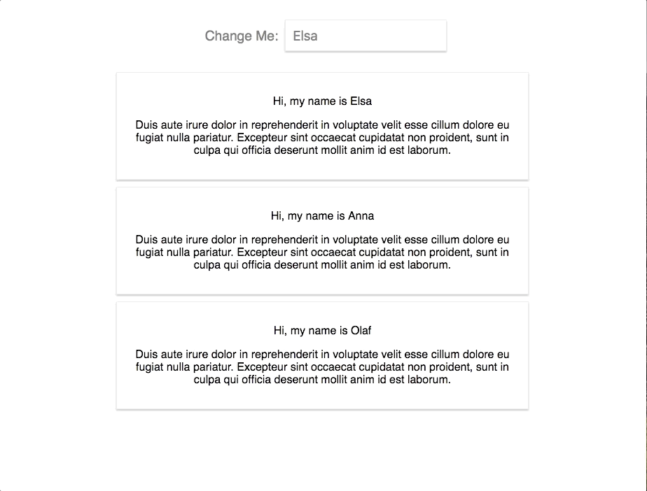

## Exercise for chapter 3

Follow the instructions and try to implement a solution on your own:

0. Create a new react project using create-react-app
1. Create TWO new components: UserInput and UserOutput:

	- UserInput should hold an input element
	- UserOutput should include two paragraphs
2. Output multiple UserOutput components in the App component (any paragraph texts of your choice)
3. Pass a username (of your choice) to UserOutput via props and display it there
4. Add state to the App component (=> the username) and pass the username to the UserOutput component
5. Add a method to manipulate the state (=> an event-handler method)
6. Pass the event-handler method reference to the UserInput component and bind it to the input-change event
7. Ensure that the new input entered by the user overwrites the old username passed to UserOutput
8. Add two-way-binding to your input (in UserInput) to also display the starting username
9. Add styling of your choice to your components/ elements in the components - both with inline styles and stylesheets

This is what my [final solution](/.03.1-exercise-solution) looked like:
