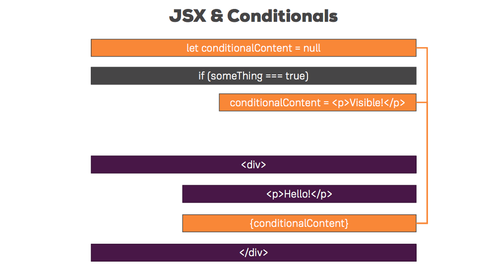

## Rendering Lists and Conditional Content

### Conditional Content

Let's change the functionality of our button to display and hide `Person` components. Since the button is inside `App.js` as well as the state of the app - we can complete this change by only making changes to `App.js`. 

Achieving this requires a few steps that we already know how to do: 

- Add a method `switchNameHandler`
- Cnahge the button text to `Show/Hide persons`
- Swap the current `onClick` value in the button to:  `onClick={this.togglePersonsHandler}` 
- Add another property to `state` to hold `showPerson` current state, which is boolean. `true` indicates that `Persons` is shown, and vice versa
- Inside `togglePersonsHandler` change the `showPersons` property to `!this.state.showPersons`, which translates to the opposite of the current state

Lastly, we need to add a condition inside `render()` that displays persons when `showPersons` is true, and hides it when `showPersons` is false. Bacaus the div is inside the JSX section of the `render()` function (ie in the return statement), we can add JS code to this section inside curly brackets, so we could use a simle ternary condition to achieve this. 

To make this work, we'll need to:

- Wrap the hidden content in a div
- Wrap the containing div in curly brackets
- set the condision `this.state.showPersons ? ` before the div
- Lastly, ternary conditions also requires setting an expression to render if false, so we add `: null` right after the closing div. 

This should look like this:  

```
{ this.state.showPersons ? 
	<div>
	 <Person 
	 name={this.state.persons[0].name} 
	 age={this.state.persons[0].age} 
	 location={this.state.persons[0].location}
	 />
	 <Person 
	 name={this.state.persons[1].name} 
	 age={this.state.persons[1].age} 
	 location={this.state.persons[1].location} 
	 click={this.switchNameHandler.bind(this, "Let it go!")}
	 changed={this.nameChangedHandler}
	 >My hobbies: Rescuing my sister
	 </Person>
	 <Person 
	 name={this.state.persons[2].name} 
	 age={this.state.persons[2].age} 
	 location={this.state.persons[2].location}
	 />
	</div> : null}
```

This block of code makes it harder to follow and you could easily miss the `: null` section at the end of it. The preferred way to do this is by keeping the code cleaner. 

It's important to note that we could add JS to the first section of our `render()` method. Anything before the `return` statement is regular JS code (and not JSX), so we could use `if` statements, conditions, etc. 

The preferred way to do this is by (1) creating a variable to hold all the content we want to display/hide, (2) put the code inside the appropriate `if` statement, (3) add the variable to our JSX code (ie inside the return statement). 

This is how the completed `render()` method looks after these changes: 

```
render() {
    let persons = null;

    if (this.state.showPersons) {
      persons = (
       <div>
         <Person 
         name={this.state.persons[0].name} 
         age={this.state.persons[0].age} 
         location={this.state.persons[0].location}
         />
         <Person 
         name={this.state.persons[1].name} 
         age={this.state.persons[1].age} 
         location={this.state.persons[1].location} 
         click={this.switchNameHandler.bind(this, "Let it go!")}
         changed={this.nameChangedHandler}
         >My hobbies: Rescuing my sister
         </Person>
         <Person 
         name={this.state.persons[2].name} 
         age={this.state.persons[2].age} 
         location={this.state.persons[2].location}
         />
       </div>
        );
      }

   return (
     <div className="App">
       <h1>Participants</h1>
       <button
       onClick={this.togglePersonsHandler}>Show/Hide persons</button>
       {persons}
     </div>
	 );
	}
``` 

Look how short the return statement is this time. It's much easier to see the condition in the top part of  the `render()` method, and all the returned items are conviniently arranged at the bottom. 



### Rendering Lists

Looking at the previous block of code, you might notice we're using `<Person />` three times. This isn't necessary because we could simply use the `map()` method to render all the elements in `state`. 

You can start by deleting all the long `<Person />` tags from your code, and adding the map function that will render empty `Person` tags like so: 

```
if (this.state.showPersons) {
  persons = this.state.persons.map(person => {
      return <Person />
  });
}
```

Once you save your file, you'll see all that's left to do is to pass in the attributes as props. This also has a shorter syntax, because instead of acessing the attributes through `state` (ie `this.state.persons[2].name`) we can do this through the `person` item we declared on `map`, like so: 

```
if (this.state.showPersons) {
  persons = 
    <div>
      {this.state.persons.map(person => {
          return <Person name={person.name} age={person.age} 
                  location={person.location} />
        })}
    </div>
}
``` 
We'll address the key warning that popped up soon (`Warning: Each child in an array or iterator should have a unique "key" prop.`).

#### Deleting a list item

Let's implement a click handler that will delete a list item (or a  `Person`) from the display. 

The steps to take: 

- Add a method `deletePersonHandler` that listens to clicks on a specific element (`<Person />` element) 
- Listen to the click inside each `Person` and passing in the function `deletePersonHandler`
- Once there's a click -> get the index of the specific `Person` from the `map` method so we can remove the correct item
- Inside `deletePersonHandler` use the index (passed as argument) to remove the specific item from the list by using `setState` and `splice()`.

Here's how this will look: 

```
deletePersonHandler = (personIndex) => {
	// copies the array
	const persons = this.state.persons.slice; 
	persons.splice(personIndex, 1);
	this.setState(persons: persons);
	}
 
render() {
	let persons = null;
	
	if (this.state.showPersons) {
	  persons = 
	    <div>
	      {this.state.persons.map((person, index) => {
	          return <Person click={() => this.deletePersonHandler(index)} 
	                  name={person.name} age={person.age} 
	                  location={person.location} />
	        })}
	    </div>
}
```

### Key prop missing error

Time to address the key warning that popped up in the console: `Warning: Each child in an array or iterator should have a unique "key" prop`.

The key prop is an important property we should add when rendering lists of data. It's a default prop React expects to find in a component. It could be a custom component or a default HTML element which you render through a list. This key prop helps react update the DOM efficiently. It allows react to know what it needs to adjust in the DOM. In short, React constatnly compares the current state with the new state of the DOM. For a list it needs to find out which element changed. In a list - it needs a unique key prop for each list item. This way it can spot which one changed faster. By default, react will simply render the full list to make sure the correct element was updated. However, this isn't efficient, so assigning a key prop will help monitoring list items that changes, and allow react to update the DOM more efficiently. 

In general, most datasets we use will have a unique id. In this practice we can add an `id` field into each object, and add the `key` property to each `Person` element liks so: 

```
if (this.state.showPersons) {
  persons = 
    <div>
      {this.state.persons.map((person, index) => {
          return <Person 
                  click={() => this.deletePersonHandler(index)} 
                  name={person.name} age={person.age} 
                  location={person.location}
                  key={person.id} />
        })}
    </div>
}
```

### Flexible Lists

Quick reminder: in section 3 we created input tags that allow the user to dynamically change the `p` text to whatever they type. Let's fix this functionality to work inside our rendered list. 

First, we need to add an event listener in our `Person` list item. We'll need to pass two things to the function this time: the event (so we know what the user typed) and `person.id`, which will allow us to change the correct field. 

First, our `Person` tag will now look like this:  

```
persons = 
	<div>
	  {this.state.persons.map((person, index) => {
	      return <Person 
	              click={() => this.deletePersonHandler(index)} 
	              name={person.name} age={person.age} 
	              location={person.location}
	              key={person.id} 
	              changed={(event) => this.nameChangedHandler(event, person.id)} />
	    })}
	</div>
}
```

Next, let's change `nameChangedHandler` so it uses the event.target.value as a new name, and the id to change our list items.

```
nameChangedHandler = (event, id) => {
	// find the person we typed in by using findIndex
	// findIndex executes a func it on every item in the array
	const personIndex = this.state.persons.findIndex(p => {
	  return p.id === id;
	});
	// insert the desired person into a new object with all it's properties
	const person = {...this.state.persons[personIndex]};
	// update the copy of the object
	person.name = event.target.value;
	//
	const persons = [...this.state.persons];
	persons[personIndex] = person;
	
	this.setState( { persons: persons });
}
```


