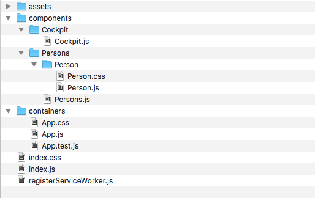
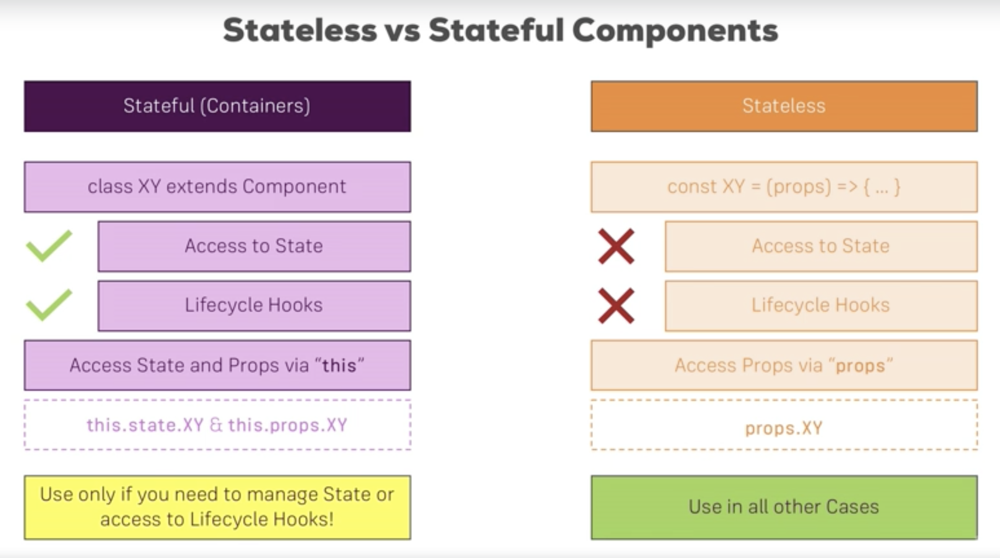
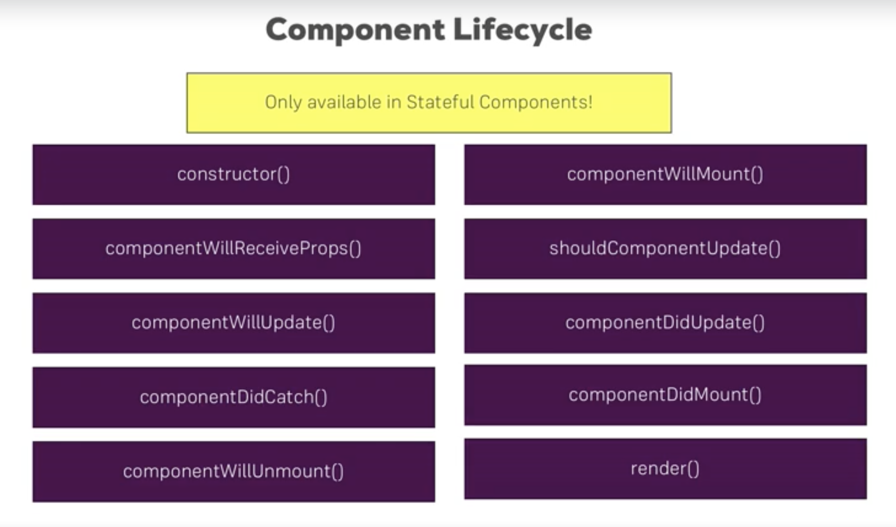
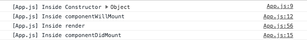
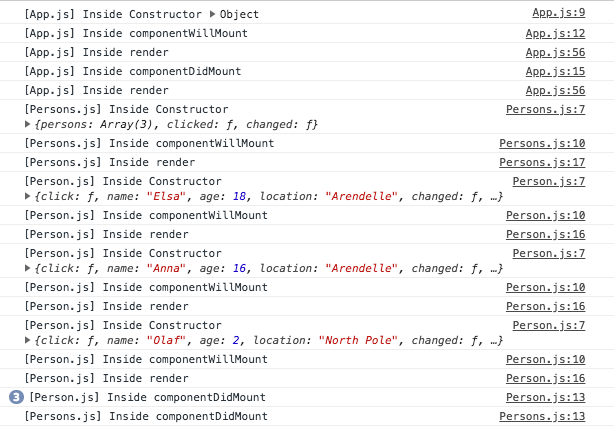
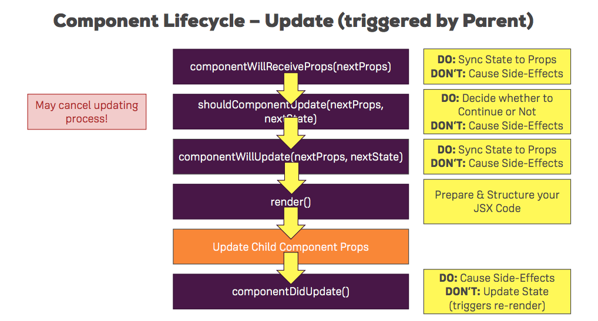
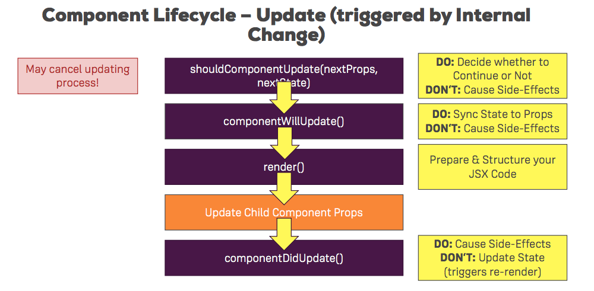
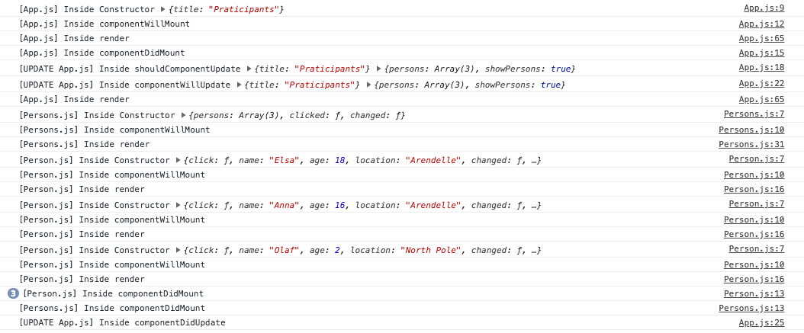

## Deep Dive Into Components 

We're going to split our `App.js` file to a number of components. We currently do a lot of things in that file. For example, the render method (1) renders the list of `Person`s, and also manages the button component. The render method should be rather lean and contain not too much JSX.

For example, we might want to create a `Person` list component. This way we'd outsource a lot of code and get a leaner `render()` method. Another improvement is to outsoucrse our cockpit into its own component. 

The goal: have a more focused App component as well as a more focused components in general. 

### Better Project Structure

The first recommended step is to recreate our file structure. 

Inside the `src` folder: 
	- Create an `assets` folder 
	- Create a `components` folder 
	- Create a `containers` folder

Inside the `components` folder: 
	- Create a `Persons` folder and inside it a `Persons.js` file
	- Create a `Cockpit` folder and inside it a `Cockpit.js` file

Inside the `containers` folder: 
	- Move `App.js`, `App.css` and `App.test.js` into this folder 

Ofcourse, our app won't work now because our import commands are wrong. Take the time to fix these to work with the new file structure. 



### Splitting the app into components

`Persons.js` can be a functional component, because we don't need to manage state. In order to create it, we'll copy the map method we used in `App.js`, and ajust it like so: 

```
import React from 'react';
import Person from './Person/Person';

const persons = (props) => (props.persons.map((person, index) => {
	return <Person key={person.id}
			click={() => props.clicked(index)} 
            name={person.name} age={person.age} 
            location={person.location}
            changed={(event) => props.changed(event, person.id)} />
    })

);

export default persons;
```

Things to note: 
- If we're only returning something from the function, we can ommit the `return` keyword, and just put everything we want to return inside parenthasis. 
- `this` doesn't exist here - we need to change it to `props`
- the methods names don't exist here, so we need to change them from `deletePersonHandler` to `clicked` and `nameChangedHandler` to `changed`
- In the `App.js` file, import `Persons` and delete the `Person` import
- In `App.js` pass `persons`, `clicked`, and `changed` into `Persons`

This is how `Persons` should look now: 

```
<Persons persons={this.state.persons} 
      clicked={this.deletePersonHandler} 
      changed={this.nameChangedHandler} />
```

Save your files, and the app should work as before. Although it's working like before - we improved the structure of the files a little. `App.js` doesn't have to worry about `map` any more. We outsourced it to `Persons` to keep our containers lean. 

The same goes for the `Cockpit`, where we need to put the `h1`, `p`, and `button` components. 

Going through the same process for `Cockpit`, the files should look like so: 

**Cockpit.js**

```
import React from 'react';
import classes from './Cockpit.css';

const cockpit = (props) => {
	let assignedClasses = [];
    let btnClass = '';    
    if (props.showPersons) {
      btnClass = classes.red;
    }

    if (props.persons.length <= 2) {
      assignedClasses.push( classes.red );
    }
    if (props.persons.length <=1) {
      assignedClasses.push( classes.bold );
      assignedClasses = assignedClasses.join(' ');
    } 

	return (
		<div className={classes.Cockpit}>
			<h1>Participants</h1>
       		<p className={assignedClasses} >Dynamically update classes</p>
       		<button className={btnClass}
       		onClick={props.clicked}>Show/Hide persons</button>
		</div>
	);
}

export default cockpit;
```


**Cockpit.css **

```
.red {
	color: tomato;
}

.bold {
	font-weight: bold;
}

.Cockpit button {
	background-color: #70a970;
  font: inherit;
  border: 1px solid #ccc;
  padding: 8px;
  cursor: pointer;
  box-shadow: 0 2px 2px #ccc;
  outline: none;
}

.Cockpit button:hover {
	background-color: darkseagreen;
}

.Cockpit button.red {
	background-color: tomato;
	color: black;
}

.Cockpit button.red:hover {
	background-color: salmon;
	color: black;
}
```


**App.js**

```
import React, { Component } from 'react';
import classes from './App.css';
import Persons from '../components/Persons/Persons';
import Cockpit from '../components/Cockpit/Cockpit';

...
// state, methods, etc
...
 
  render() {
    let persons = null;
    if (this.state.showPersons) {
      persons = 
          <Persons persons={this.state.persons} 
            clicked={this.deletePersonHandler} 
            changed={this.nameChangedHandler} />
    }

   return (
     <div className={classes.App}>
        <Cockpit clicked={this.togglePersonsHandler} 
          persons={this.state.persons}
          showPersons={this.state.showPersons} />
        {persons}
     </div>
	 );
	}
}

export default App;
```

### Comparing Stateless and Stateful Components

We should try to create functional components as often as possible, because these components have a narrow focus and a clear responsibility. They are about rendering JSX and contain some logic. They don't do much else, and they can't manage state. The reason for the seperation is we want to have few places where the application state changes. This makes sure the app stays maintainable as it grows. The more it grows, it hard to maintain it. Changing state in many components - makes it harder to maintain state changes. If we only change state in a few containers the code is easier to manage. 

Core foundations of a good react app: 

- **Use the class based components as little as possible, but of course, don't be afraid to use them if it makes sense.**
- **Use stateful (containers) only if you need to manage state or access to Lifecycle hooks. Use stateles components in all other cases.** 




**Note:** Containers could also have props. We could, for example, pass props from `index.js` into `App.js`. The way to access props from within `App.js` is: `{this.props.propsName}`.

### Component Lifecycle

When react creates a component for us (instanciate and renders a component), it runs through multiple lifecycle phases. We can define methods in stateful component (only in stateful components) which react will execute, which allows us to run some code during some of these lifecycle methods. 



Not all methods are executed during creation. 

#### Methods executed during component creation: 

- **constructor(props)**: This is executed first. This is a default ES6 feature. React creates the component, and passes any propsv this component received to the constructor. If we implement the constructor method we need to call `super(props)` and pass on props. This calls the constructor of the parent class. The parent class is the Component object we imported from react. By calling super() and passing props, things like `this.`. We may also intialize the state in the constructor. Never cause side-effects (eg reaching out to a web server). We should not do that in the constructor, because it might lead to re-rendering of the app, or the state becoming unpredictable. 

- **componentWillMount()**: This method is executed next. It is defined by react. It exists for historic reasons, mainly. We don't really use it anymore. If used, it's used to update state or do last minute optimization, but we still don't want to cause side effects by calling a web server. Chances are we won't implement it in our app. 

- **render** : This executed next. This doesn't access the real DOM (we'll cover this later in the course). This method gives react an idea of what is should look like if it then reaches out to the real DOM and manipulates it. The render() method clearly defines how your app should look like from an HTML perspective. Once we call `render()` and define our JSX code, react knows which components we included, so it will then go ahead and renders child components. 

- **componentDidMount()**: Basically tells you that this component was successfully mounted. This can cause Side effects. For example if we fetch data from the web we shouldn't set state in component did mount. This will trigger re-rendering. 

If we need access to a lifecycle method, we need to have a stateful component. So, we'll turn `Persons` and `Person` into stateful components. 

To do this we'll need to: 

- change the variable `persons` into a class (also change name to `Persons`)
- change `props` into `this.props` since this is now a class


**Persons.js**

```
import React, { Component } from 'react';
import Person from './Person/Person';

class Persons extends Component {
	render() {
		return this.props.persons.map((person, index) => {
			return <Person key={person.id}
				click={() => this.props.clicked(index)} 
	            name={person.name} age={person.age} 
	            location={person.location}
	            changed={(event) => this.props.changed(event, person.id)} />
    })

	}
}

export default Persons;
```

Do the same for the `Person` component.

Now that both components are changed, we can implement Lifecycle hooks. Creating these methods inside `App.js` will overide reacts default implementations, and will allow us to see the order of execution in the console: 

```
constructor(props) {
super(props);
console.log('[App.js] Inside Constructor', props);
}
componentWillMount() {
console.log('[App.js] Inside componentWillMount');
}
componentDidMount() {
console.log('[App.js] Inside componentDidMount');
}
```




Let's do the same in our other class components, save, and look at the console to see when these copmonents are mounted and rendered. When we refresh the page we don't see anything in the console that indicates `Persons.js` nor `Person.js`. This makes sense, because in the initial state of the app we don't show the `Persons` list. We only show this conditionally. As soon as we click `toggle persons` we'll be able to see the console changes:




- The first 4 lines refer to the initial rendering of `App.js`. 
- The next `render()` line referrs to the render that occured right after clicking the button. 
- Then we ececute the `Persons.js` methods, up until `render()`. 
- Then, we don't see `componentDidMount()` inside `Persons.js`. Instead we see the constructor of `Person.js` component. React is rendering the child components first, and only then runs `componentDidMount()`.
- `Person.js` methods run for all three instances up to `render()`. React then runs `componentDidMount()` for each instance, and only then `Persons.js` component `componentDidMount()`. 

React creates functional components the same way, but there we can't add our own methods to see this. 

### Update triggered by parent (changing props)




- **componentWillReceiveProps(nextProps):** This method is the first to be executed. One thing we can do is synchronise our local state to the component props. Don't cause side effects by reaching out to a webserver to fetch data, because this will lead to rerendering and perfomance issues. 
- **shouldComponentUpdate(nextProps, nextState):** This method may cancel the updating process. In all the other methods we don't return anything, but in this one we can return true or false. Returning false can improve performance. As always, we shouldn't cause side effects. 
- **componentWillUpdate(nextProps, nextState):** Here we also get access to upcoming props and state. Here, again, we might sync our state to props. We also shouldn't cause side effects here as well. 
- **render():** 
- **Update all child components**
- **componentDidUpdate()**: Here we can cause side effects, and we shouldn't update state since it might trigger re-rendering. 

Let's look at this in our app by updating `Persons.js` and adding this method: 

```
componentWillReceiveProps(nextProps) {
	    console.log('[UPDATE Persons.js] Inside componentWillReceiveProps', nextProps);
	  }
```

Save, and check out your console. You won't see this initially, but when you, for example, delete one of the persons by clicking on it, your console will show: 

- `App.js`: `render()`
- `Persons.js`: `UPDATE...`, which means `componentWillReceiveProps` was executed 
- `Persons.js`: `render()`
- `Person.js`: `render()`, which means each of the person components (that were not deleted) are rendered in case there are any changes. 

Now let's implement `shouldComponentUpdate` and set it to return false. This helps save performance, but it's important to see how it's reflected in the console and the DOM: 

```
shouldComponentUpdate(nextProps, nextState) {
	    console.log('[UPDATE Persons.js] Inside shouldComponentUpdate', nextProps, nextState);
	    return false;
}
```

When we click to delete a person, the page won't update. We can see in the console that the update method is called, and the deletion is done it we look at the props. However, it doesn't render the DOM. 

Why would we return false? We might have cases where we know that no update is required. Here, for example, we know we only want to update the DOM if the props are different than the state. We might write: 

```
return nextProps.persons !== this.props.persons
```

Lastly, let's implement the last methods: 

```
componentWillUpdate(nextProps, nextState) {
	console.log('[UPDATE Persons.js] Inside componentWillUpdate', nextProps, nextState);
}
componentDidUpdate() {
	console.log('[UPDATE Persons.js] Inside componentDidUpdate');
}
```


### Internally triggered update (changing state)



This is just about the same process as before, with one difference: the first lifecycle hook `componentWillReceiveProps(nextProps)` is missing since the change is triggered internally.

The logic for the next steps is the same as before: 

- **shouldComponentUpdate(nextProps, nextState)**
- **componentWillUpdate(nextProps, nextState)** 
- **render()** 
- **Update all child components**
- **componentDidUpdate()**

Let's implement this in `App.js`, where we change the state. This is how the console looks after implementation: 



**The importance of `shouldComponentUpdate()`**: React might go through a number of methods without anything changing. This method allows us to improve performance and prevent react from executing methods that aren't necessary. In bigger apps with a lot of child nodes, going through all the render() methods even when nothing changes really affects performance. One way to prevent this is to make sure something actually changes (eg `return nextProps.persons !== this.props.persons`). We can add this kind of check for other props. This way, only if any of the props changes we continue with the update. 

### Pure Component

Say we want to execute a shallow check on our objects to make sure something actually changed: 

```
shouldComponentUpdate(nextProps, nextState) {
	return nextProps.persons !== this.props.persons ||
				nextProps.changed !== this.props.changed ||
				nextProps.clicked !== this.props.clicked;

```

If all we want to do is this shallow check, we don't have to implement `shouldComponentUpdate`. We can instead inherit from a different component. It has these checks already built in. It will only continue updating if it detects changes. The way to do this is by creating our class by extending `PureComponent` rather than `Component`.

We shouldn't use Pure component everywhere. We should only use it where we suspect that updates might not be required. We shouldn't make everything PureComponent because that might also negatively affect performance. After all, comparing old states and props to new states and props takes a bit of performance. So not everything should be pure component. 


### Rendering and Updates

Updating in React happen from top to bottom, and only if the state or props change. Since update is done top to bottom, we can put `shouldComponentUpdate` as high as possible in the tree in a container. This way the child elements won't update if there's not change. 


React automatically optimizes this updating process by not hitting the real DOM all the time. There's a big difference between the `render()` method being called and the real DOM being changed. 

### How doew React update the real DOM? 

- `render()`: the name is misleading. It does not immediately renders it to the DOM. This is merely a suggestion of what the HTML should look like in the end. But render() might lead the the HTML displayed unchanged. This is why we use `shouldComponentUpdate()`. 
- Sometimes a prop would change but we'll still render the same thing. Even then, it doesn't immediately hits the real DOM.  
- React compared virtual DOMs. It has an old virtual DOM and a rerendered DOM. React takes the virtual DOM because it's faster than the real DOM.
- A virtual DOM is a DOM representation in JS. You can represent the entire HTML in JS. This is what happens here. 
- React keeps 2 copies: the old virtual DOM version and the rerendered version which is the one that gets created when the `render()` method is called. React compares both versions. 
- If it can detect a different, it updates the **real DOM **only in the places where a change has been made. 
- If it doesn't detect a difference - the **real DOM** isn't touched. The real DOM isn't touched.  
- Accessing the DOM is really slow. We want to do this as little as possible. 

### Returning ajacent elements 

We learned that our components usually have a wrapping elements, and that we shouldn't have sibling elements inside the returned statement unless they're wrapped in a div. This restriction is loosened in react 16 (for example, in `map()` we're returning an array of elements).

#### Returning an array: 

Similarly we could return an array of elements in `Person.js`, like so: 

```
return [
	<p key='1' onClick={this.props.click}>I am {this.props.name} and I am {this.props.age} year old! I live in {this.props.location}!</p>,
	<p key='2' >{this.props.children}</p>,
	<input key='3'  type="text" onChange={this.props.changed} />
];
```

Note, we need to add a unique id to each element, otherwise we'll get a console error. 

#### Returning a HOC: 

- Inside `src` we'll create a folder called `hoc` for higher order component. 
- Create a file called `Aux.js` (auxiliary).
- HOC are not representational but they wrap other components to add a certain functionality.
- This component will be a function which get props, and returns some JSX. In there all we want to do is output `{props.children}`. Since this is all the function returns, we can write this like so: 

	```
	const aux = (props) => props.children;

	export default aux;
	```
- Import and use this inside `Cockpit.js` and wrap the returned elements wrapped in an `Aux` div.

- If your project uses `react 16.2`, you can now use a built-in `Aux` component, so called fragment, like so: 

```
<>
	<h1>Some title</h1>
	<p>Some longer text</p>
</>
```

- Behind the scenes, this empty tag does the same thing our `Aux` component did. 


### Understanding HOC's

- We'll often use HOC's when using third party packages. We'll need them to add a certain logic to our components. Some logic we may need in a number of component, that we don't want to add to each component individually. 
- For example, we're wrapping our returned items in a div that applies the className `classes.style` in two places. It would be better to do this more efficiently. We can create a HOC to do this for us.

First approach:  
- Create a file `WithClass.js` inside the folder `hoc`
- receive props of class name
- apply class to wrapping div
- return {props.children} inbetweein the div 

```
import React from 'react';

const withClass = (props) => (
	<div className={props.classes}>
		{props.children}
	</div>
);

export default withClass;
```

We can then import and use it inside `Person` and `App`, like so: 

```
return (
	<WithClass classes={classes.Person} >
		<p onClick={this.props.click}>I am {this.props.name} and I am {this.props.age} year old! I live in {this.props.location}!</p>
		<p>{this.props.children}</p>
		<input type="text" onChange={this.props.changed} />
	</WithClass>
);
```

Second approach:  
- Create a file `withClass.js` inside the folder `hoc`
- receive arguments `WrappedComponent`, and `className`
- return function which receives props and will render it to something 
- use the function to alter `App.js` in the export statement


```
import React from 'react';

const withClass = (WrappedComponent, className) => {
	return (props) => (
		<div className={className}>
			<WrappedComponent />
		</div>
	)
}

export default withClass;
```

Inside `App.js`: 

```
   return (
     <Aux>
        <Cockpit 
          appTitle={this.props.title}
          clicked={this.togglePersonsHandler} 
          persons={this.state.persons}
          showPersons={this.state.showPersons} />
        {persons}
     </Aux>
	 );
	}
}

export default withClass(App, classes.App);

```

In this example, we used `AUX` to add a wrapping div around our returned items, and then used the function `withClass` with the arguments `App` and `classes.App` in order to apply the styling to `App`. 

The app looks good on first look, but the functionality was lost with this change. All the props are missing on our props components. The reason for this is we're outputing wrapped components, but wrapped components could be either `App.js` or `Person.js`. 

The way to resolve this is to pass on the existing props. This works thanks to an ES6 operator: `spread`. Props are an object of key value pairs, so we could pass this object into the function, like so: 

```
import React from 'react';

const withClass = (WrappedComponent, className) => {
	return (props) => (
		<div className={className}>
			<WrappedComponent {...props} />
		</div>
	)
}

export default withClass;
```

This higher order component doesn't have to return a functional component. If we need access to lifecycle hooks, we could return a class (stateful component), like so: 

```
import React, { Component } from 'react';

const withClass = (WrappedComponent, className) => {
	return class extends Component {
		render() {
			return (
				<div className={className}>
					<WrappedComponent {...this.props} />
				</div>
			)

		}
	}
}

export default withClass;
```

This returns an anonymus class. We have a function that returns a class on demand, so the class name doesn't matter. 

### Passing unknown props

Say we want to count the time `togglePersonHandler` is clicked. We'll start by adding a new key to our state, and assigning it to `0`. Once we've done that, we might want to update the counter inside `togglePersonHandler` like so: 

```
togglePersonsHandler = (event, id) => {
  const doesShow = this.state.showPersons;
  this.setState( { showPersons: ! doesShow,
                    toggleClicked: this.state.toggleClicked + 1});
}
```

This might work sometimes, but we shouldn't use it. The reason is `setState()` is a method that executes asynchronisly by react. This means that we can't rely on this state being called inside `setState` to realy reflect the latest version of the state. If we called `setState` in another place in the app, this state might not be correct. 

The correct and recommended syntax: 

```
togglePersonsHandler = (event, id) => {
const doesShow = this.state.showPersons;
this.setState( (prevState, props) => { 
  return {
    showPersons: !doesShow,
    toggleClicked: prevState.toggleClicked + 1
  }
});
}
```

This is safer because prevState can't be accessed from anywhere else in the app. 

### Validating props

We also have a better way to handle props. This is useful if your code is handeled by other devs. We can inforce certain values to inforce that our props are of the type we expect them to be. For example, if a value should be boolean - we won't want anyone to pass in anything but a bool value. We want to check the types of the incoming properties to make sure we're using it correctly. 

For that, there's an extra package we can add to our react app. 

```
npm install --save prop-types
```

After installing it, import prop-types inside `Person.js`, like so: 

```
import PropTypes from 'prop-types';
```

To use this, go below your class definition, then taking your class and adding the `PropTypes` property. 

```
Person.propTypes = {
	click: PropTypes.func,
	name: PropTypes.string,
	age: PropTypes.integer,
	changed: PropTypes.func
}
``` 

### Using references ("ref")

We can add a special attribute to `input` called `ref` which can help us focus the text input to the first person input field. 

`ref` takes a dynamic input, which should be a function. In this function we set up a reference for the input tag: 

```
ref={(inp) => {this.inputElement = inp}}
```

We then need to add this to `componentDidMount`, but since we have multiple input elements, and we want focus on the first one - we'll need to also pass the index. In `Persons.js`, add the props: `position = {index}` inside the return statement. Lastly, your `componentDidMount()` method should now look like this: 

```
componentDidMount() {
	console.log('[Person.js] Inside componentDidMount');
	if (this.props.position === 0) {
		this.inputElement.focus();
	}
}	
```

Inside the method we're checking the position is 0, and if so - we're calling the focus method. 

This should be used for a few selected things, like focus or media playback. 


### More on Ref API ([React 16.3](https://reactjs.org/blog/2018/03/29/react-v-16-3.html))

There's now an easier way to implement the focus and creating references. We do that in the constructor by creating a new class property: 

```
this.inputElement = React.createRef();
```

inside our input tag we add: `ref={this.inputElement}`.

Lastly, when we use it, we need to access the current component like so: 

```
componentDidMount() {
console.log('[Person.js] Inside componentDidMount');
if (this.props.position === 0) {
	//add 'current' property to the path
	this.inputElement.current.focus();
}
}	
```

-

React 16.3 also supports forwarded reference. This means that we get a reference from outside of a component through that component. This is helpful for working with wrapper components. 

The new context api is a great tool for passing global state around in our app. We sometimes have some global state, like the authentication status. Passing down the value is an option, but we can use the authentication api to make this easier. 

### Updated lifecycle hooks ([React 16.3](https://reactjs.org/blog/2018/03/29/react-v-16-3.html))

Lifecycle methods to avoid: `componentWillMount`, `componentWillUpdates`, `componentWillReceiveProps`. They are discouraged because they were often used incorrectly. We'll rarely use these three. 

React offers two new lifecycle hooks: 

`getDerivedStateFromProps(nextProps, prevState)`: Executed whenever our props are updated, and it gives us an option to update state along with them. 

	For example, in our `App.js` we can use: 

```
static getDerivedStateFromProps(nextProps, prevState) {
	console.log(
	  "[UPDATE App.js] Inside getDerivedStateFromProps",
	  nextProps,
	  prevState
);
```

`getDerivedStateFromProps` is called before `render()` and `didMount`. 

The second lifecycle hook added is `getSnapshotBeforeUpdate`: allows you to get a snapshot of your DOM right before it's about to change. 

Add this to your `App.js` to see when this is executed: 

```
  getSnapshotBeforeUpdate() {
    console.log(
      "[UPDATE App.js] Inside getSnapshotBeforeUpdate"
    );
  }
```

This is useful, for example, to save the current scrolling position for your user.