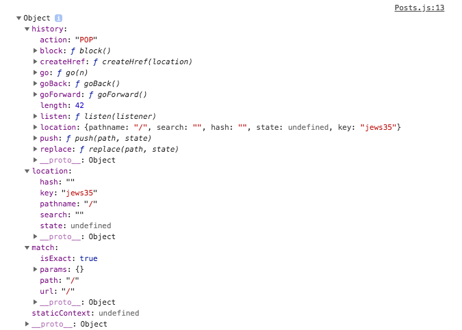

### Routing

We're going to look into a feature we'll need to add to most of our React apps. Routing is not built into the core of react. We'll need to add it first. React in its core is just a component creation library. We'll now turn it into much more of a framework by adding and using Routing. 

Routing is about being able to show different pages to the user. Most web apps have more than one page. How do we implement multiple pages in a single page app? We want to show the user different pages for different URL's. We don't really have different files, but we simply re-render parts of the single page, depending on which path the user navigated to. Routing is about parsing the path, and showing the correct JSX. In order to use this, we'll need to add a Router package. 

The router package will: 

1. Parse URL/Path to understand where the user wants to go to. 
2. Read our configuration
3. Render/ Load the appropriate JSX/ Component 

#### Setting up links

We're back in our `reaching to the web` app. We want to add links (we'll later add routing to support these links). 

Go into your `Blog.js` file. In our Render method, we'll edit the return statement so we also return a header with some nav items: 

```
<header>
    <nav>
        <ul>
            <li><a href='/'>Home</a></li>
            <li><a href='/new-post'>New Post</a></li>
        </ul>
    </nav>
</header>
```	

You can use  the styling: 

```
.Posts {
    display: flex;
    flex-flow: row wrap;
    justify-content: center;
    width: 80%;
    margin: auto;
}

.Blog ul {
	list-style: none;
	margin: 0;
	padding: 0;
	width: 100%;
	text-align: center;
}

.Blog li {
	display: inline-block;
	margin: 20px;
}

.Blog a {
	text-decoration: none;
	color: black;
}

.Blog a:hover,
.Blog a:active {
	color: orange;
}
```

#### Setting up routing package

- Quit your development server 
- Run the command `npm install --save react-router-dom` to install two packages 
- Run `npm start`

Now that the packages are installed, we want to tell react to only load the posts components when the path is `/` (inside the home page). 

First, enable routing in your app inside `App.js` or `index.js`. For example, inside `App.js` you need to first import `BrowserWrapper` and wrap your return statement with it, like so: 

```
import React, { Component } from 'react';
import { BrowserRouter } from 'react-router-dom';

import Blog from './containers/Blog/Blog';

class App extends Component {
  render() {
    return (
    	<BrowserRouter>
	      <div className="App">
	        <Blog />
	      </div>
      </BrowserRouter>
    );
  }
}

export default App;
```

Instead of using our components inside `Blog.js` we're going to instead load them through routing. That turns them into containers because they are no longer included by some other component. They will now be on the route level, being exchanged for previously root level components.  

Inside the Blog component we want to make sure only the posts are shown in the homepage. 

1. Move `FullPost` and `NewPost` into the `Blog` folder.
2. Create a new folder inside `Blog` called `Posts` with a `Posts.js` file inside it. 
3. For the posts container we're going to use most of the `Blog.js` code: 

```
import React, { Component } from 'react';
import axios from '../../../axios';

import Post from '../../../components/Post/Post';
import './Posts.css';

class Posts extends Component {
    state = {
        posts: []
    }

    componentDidMount () {
        console.log(this.props);
        axios.get( '/posts' )
            .then( response => {
                const posts = response.data.slice(0, 4);
                const updatedPosts = posts.map(post => {
                    return {
                        ...post,
                        author: 'Max'
                    }
                });
                this.setState({posts: updatedPosts});
                // console.log( response );
            } )
            .catch(error => {
                console.log(error);
                // this.setState({error: true});
            });
    }

    postSelectedHandler = (id) => {
        this.setState({selectedPostId: id});
    }
    
    render () {
        let posts = <p style={{textAlign: 'center'}}>Something went wrong!</p>;
        if (!this.state.error) {
            posts = this.state.posts.map(post => {
                return <Post 
                    key={post.id} 
                    title={post.title} 
                    author={post.author}
                    clicked={() => this.postSelectedHandler(post.id)} />;
            });
        }

        return (
            <section className="Posts">
                {posts}
            </section>
        );
    }
}

export default Posts;
```

Our `Blog.js` is now a lot leaner: 

```
import React, { Component } from 'react';
import Posts from './Posts/Posts';
import './Blog.css';

class Blog extends Component {
    render () {
        return (
            <div className='Blog'>
                <header>
                    <nav>
                        <ul>
                            <li><a href='/'>Home</a></li>
                            <li><a href='/new-post'>New Post</a></li>
                        </ul>
                    </nav>
                </header>
                <Posts />
            </div>
        );
    }
}

export default Blog;
```

Now we need routing to control which page loads for which path. 

#### SWitching between pages

Inside our `Blog.js` we don't want to always load `<Posts />`. Rather we want this tag to change depending on our path. 

- Import route and add it to your JSX code, like so: 

	```
	import React, { Component } from 'react';
	import {Route} from 'react-router-dom';
	
	import Posts from './Posts/Posts';
	import './Blog.css';
	
	class Blog extends Component {
	    render () {
	        return (
	            <div className='Blog'>
	                <header>
	                    <nav>
	                        <ul>
	                            <li><a href='/'>Home</a></li>
	                            <li><a href='/new-post'>New Post</a></li>
	                        </ul>
	                    </nav>
	                </header>
	                <Route />
	            </div>
	        );
	    }
	}
	
	export default Blog;
	```
	
	This isn't enough. We now need to configure Route so that it renders a different page for different paths. 
	
	The way to do this is by: 
	- using a `Route` tage 
	- Passing the `path` props to pass the desired path
	- Passing the `exact` props to let react know we only want the exact path (doesn't start with...)
	- Pass the `render` props to let react know what you want to render when that is the path
	- We can also pass a `component` property. It needs to be a reference to the function or class we want to use, for example: `component={Posts}`

	One way to do this is: 

	```
	<Route path='/' render={() => <Posts />} />
	<Route path='/new-post' exact render={() => <NewPost />} />
	```
	
	Without render you can do this like so: 
	
	```
    <Route path='/' exact component={Posts} />
	<Route path='/new-post' exact component={NewPost} />
	```
	
	We shouldn't really render a component. We should pass the componing by loading them. This is the default case. 
	
We're currently reloading the pages when we move from one to another. We don't want to reload the page, but instead we want to prevent the reloading of the page, and tell react to only re render parts of the dom that needs to re-render. 

#### Using links to switch pages 

We want to handle link clicks internally to prevent the default reloading of the pages. For that we need to change our links. 

We're currently using normal links: `a`, but we should the `Link` components instead: 

```
<ul>
    <li><Link to='/'>Home</Link></li>
    <li><Link to={{
        pathname: '/new-post',
        // hash: '#submit',
        // search: '?quick-submit=true'
    }}>New Post</Link></li>
</ul>
```

By using Link you can see the page doesn't reload. React is rerendering parts of the page. We're not loading a new page. Now our state is contained, and this is the way we should use react using the Link component.

#### Using routing related props

If we go into `Posts.js` and add a `console.log(this.props)` to the method `componentDidMount`, we'll be able to see the props. Looking at the console we see there are a number of props there that we didn't set up: 



`location` and `match` were passed by react-router. Matched gives us some information about the matched route. We also get more information about location, and history which has some methods we can use like `push`. 

Going back to the component we can also log the props in the new post. 

Add this to **NewPost.js**

```
componentDidMount() {
    console.log(this.props);
}
```

Now we can also see the props in `New-post`. 

#### The 'WithRouter' HOC & Route Props

What if we want to get this information not in one of our containers, so not in a component that was loaded using Route, but in a component which is rendered as part of such a container? 

Let's look at the `Post` component. If we look at the props we won't find `location` and `match`. If we wanted to see them, we could do one of these two options:
 
- pass them as props to Post from Posts.js
- Use a higher order component in the `Post.js` component. 

Let's see the second option. Inside `Post.js`:

- `import {withRouter} from 'react-router-dom';`. This is a higher order component which we use by wrapping our export with it: `export default withRouter(post);`. 

#### Absolute vs Relative paths

The way we write the links doesn't affect whether it's an absolute or relative path. When setting app `to` we can't control whether it's an absolute or relative path - it's always an absolute path, that will be appended to our route domain. 

If we wanted to make sure it's a relative path, and append something to the end of the current path, we would need to build this path dynamically by taking into advantage that we know on which path we're currently on. 

To do this, we could use `this.props.match.url`, which is the currently loaded path in the end. We can chain the path, like so: 

```
pathname: this.props.match.url + '/new-post'
```

#### Styling the active router

Let's add a css class to the link which is active so that we can use that class to change the styling. The way to do this is by using `NavLink` rather than `Link` inside `Blog.js`. We need to change the import statement and tag names. 

If we now look at the app we'll see the top active nav link has a class `.active`. We can now add styling in our `.css` file, like so: 

```
.Blog a:hover,
.Blog a:active,
.Blog a.active {
	color: orange;
}
```

More options: 

```
// Set a different class name for links 
activeClassName="my-active"
// inline styling 
activeStyle={{color:'pink'}}
```

#### Passing route parameters

We want to load a post when we click on it: 

**Posts.js**

```
let posts = <p style={{textAlign: 'center'}}>Something went wrong!</p>;
if (!this.state.error) {
    posts = this.state.posts.map(post => {
        return (
            <Link to={'/' + post.id} key={post.id}>
                <Post 
                    title={post.title} 
                    author={post.author}
                    clicked={() => this.postSelectedHandler(post.id)} />
            </Link> );
    });
```

**blog.js**

```
<Route path='/:id' exact component={FullPost} />
```

Saving this and going back to our app you'll see that clicking on a post takes us to the correct path, but we're not handling the post loading correctly. 

In `FullPost.js` we can access the post id by writing: `this.props.match.params.id` rather than `this.props.id`.

#### Using Switch to load a single route

`/:id` this flexible id path would also identify `new-post` as an id. We want to tell react to only choose on of the paths. Just like in JS, we can use `Switch`. We first need to import it, like so: `import {Route, NavLink, Switch} from 'react-router-dom';`

Switch tells React router to only choose one route from a given set of paths. The first paths that works is used, and react won't continue going throug other paths. 

```
<Switch>
    <Route path='/' exact component={Posts} />
    <Route path='/new-post' component={NewPost} />
    <Route path='/:id' exact component={FullPost} />
</Switch>
```

#### Navigating programatically

Sometime we'd like to navigate only after something finished. For example, after an HTTP was sent. To do this, we first need to undo everything we did in the previous step. 

We should now take advantage of that history object we received on the props. History has functions we can use, for example, going back or going forward. There is also a `push` method which allows you to push a page to the stack of pages (this is why the back/forward buttons work in the browsers). 

```
postSelectedHandler = (id) => {
    this.props.history.push({pathname: '/' + id});
}
```

This still works, but it is done programatically. This can be important from time to time, mostly used after a given opperation finishes. 

#### Nested Routes

A nested route is where we'd like to load a certain compomnenet or render a certain content inside another component which is also loaded via routing. For example, if we want to load a specific post not inside the blog component, but inside the post component - right beneath our post. 

```
<div>
    <section className="Posts">
        {posts}
    </section>
    <Route path={this.props.match.url + '/:id'} exact component={FullPost} />
</div>
```

#### Redirecting requests 

Clicking on a post component one after the other doesn't change the displayed post, because the method responsible for that is `componentDidMount` and there was no actual change to the specific component. React's goal is to be efficient, so there is no update. If we're loading a component that we're already on, it won't re-render the whole component, so componentDidMound would not run.  

We need to implement `componentDidUpdate` to manage the changes. Since it's a similar code to `componentDidMount` we can create a method and use it in both instances like so: 

```
import React, { Component } from 'react';
import axios from 'axios';

import './FullPost.css';

class FullPost extends Component {
    state = {
        loadedPost: null
    }

    componentDidMount() {
        console.log(this.props);
        this.loadData();
    }

    componentDidUpdate () {
        this.loadData();
    }

    loadData = () => {
        if (this.props.match.params.id) {
            if (!this.state.loadedPost || this.state.loadedPost.id !== +this.props.match.params.id) {
                axios.get('/posts/' + this.props.match.params.id)
                    .then(response => {
                        this.setState({loadedPost: response.data});
                });   
            }
        }
    }

    deletePostHandler = () => {
        axios.delete('/posts/' + this.props.match.params.id)
            .then(response => {
                console.log(response); 
            });
    }

    render () {
        let post = <p style={{textAlign: 'center'}}>Please select a Post!</p>;
        if (this.props.match.params.id) {
            post = <p>Loading...!</p>;
        } 
        if (this.state.loadedPost) {
            post = (
                <div className="FullPost">
                    <h1>{this.state.loadedPost.title}</h1>
                    <p>{this.state.loadedPost.body}</p>
                    <div className="Edit">
                        <button className="Delete" onClick={this.deletePostHandler}>Delete</button>
                    </div>
                </div>

            );

        }

        return post;
    }
}

export default FullPost;
```

Note that we also added a `+` to convert `+this.props.match.params.id`  to a number since our comparison compares both type and value. 

#### Redirecting requests 

Sometimes we want to redirect the user. For example, if we want to direct the user to `/post` if he visits just `/`. 

The redirect component is used in our JSX code. We can add it to our Switch statement, and specify a `from` property. For example `from="/" to="/posts"`. This is just like another route, but it doesn't render content, it just changes the URL so we reach another route where we render content. This is how we can redirect to ensure that the user is navigated to the route we'd like to have him on. 

There is also a conditional redirection we could use. We'll use it in `NewPost.js`. We want to redirect once the user clicks the submit button. We don't want to stay on that page. 

This version of redirect is different because: 

- It's outside of a Switch 
- It does not use `from` just `to`
- In involves a condition 

This is how it would look if we used it in `NewPost.js`: 

- Add the field `submitted: false` to `state`
- Updated `state.submitted` inside `postDataHandler`, like so: 

	```
    postDataHandler = () => {
    const data = {
        title: this.state.title,
        body: this.state.content, 
        author: this.state.author
    };
    axios.post('/posts', data)
        .then(response => {
            console.log(response);
            this.setState({submitted: true});
        });
	}
	```
- Inside the render method create a variable which is either `null` or a `<Redirect>` depending on `this.state.submitted`: 

	```
   let redirect = null;
   		if (this.state.submitted) {
       	redirect = <Redirect to='/posts' />
    }
	```
- Add `{redirect}` to the return statement 

#### Using History prop to redirect 

After submission, all we really want to do is switch the page. We could use `history` methods to replace the current route or push a new route. In our `postDataHandler` all we need to add is `this.props.history.push('/posts');`. This will add the path to history. 

`Push` pushes this page to the stack, so if we click `back` we'll go back to the `newPost` page. If we click `back` after redirecting we can go back, but we won't go back to the last page. Bacause `redirect` replaces the current page on the stack, and doesn't push a new one. 

#### Working with guards 

Navigation guards is something you might know from other frameworks. This refers to a case where you don't know whether the user is authinticated or not, and there are some parts in your app, some routes, you only want to allow the user to visit if he's authenticated. 

We do this by adding an `auth` field to our state, and set it to false. We can then add a condition to the `Route` and only give access if the user is authenticated. 

```
{this.state.auth ? <Route path='/new-post' component={NewPost} /> : null }
```

If we save this, we'll see we can't navigate into `NewPost`.

An alternative to this would be to check if the user is authenticated inside `componentDidMount`. You could use this method to redirect the user back (using props.history).

#### Handling 404 case (unknown routes)

We saw one way of handling 404 with redirect, because in the previous section we spoke about working with guards, which is what happens when the user can't access a page. 

One way to handle these is to add a `Route` tag without specifying a path. We can then add an anonymous function to render a message to the page, like so: 

```
<Route render={() => <h1>404 Page not found</h1>}/>
```

This is a nice catch all route, which should always come last in the switch statement. It won't work together with redirect if we redirect from slash. The reason is that `from` is treated as a prefix so they won't work together. 

#### Loading routes Lazily 

When we look at the network tab in the developer tools we see we're loading a `bundle.js` file which contains all our source code. It's bigger in development mode, and will be smaller in prod. Still, loading the entire bundle with all the code of our app upfront can be bad if we have a big app with distinct areas where a user might never visit. If the user never visit `NewPost` why should we load the code? 

`NewPost` should only be loaded if the user accesses it. Would be better not to download this, and instead download the code responsible for the current component and its children.  

This might not make a different in our current app, but it's important to know this technique for other more complex apps. 

The technique is called `called splitting` or `lazy loading`. It will work with react router 4 and for create-react-app, because code splitting depeneds on the webpack we're using. 

For this to work in this setup we need a HOC `asyncComponent.js`. The goal of this component is to allow us to load a component asynchroniously -> only when it's needed. 

Whenever we write something like `import Posts from './Posts/Posts';` we're informing webpack about a dependency, and webpack will include it in the bundle. For lazy loading this is the opposite of what we want to do. 

We need to create a `hoc` component like so: 


**asyncComponent.js**

```
import React, {Component} from 'react';

const asyncComponent = (importComponent) => {
	return class extends Component {
		state = {
			component: null
		}
		componentDidMount () {
			importComponent()
				.then(cmp => {
					this.setState({component: cmp.default});
				});
		}
		render() {
			const C = this.state.component;
			return C ? <C {...this.props} /> : null;
		}
	}
}

export default asyncComponent;
```

Then inside `Blog.js` we can remove the import statement for `NewPost.js`, and instead add: 

```
const AsyncNewPost = asyncComponent(() => {
    return import('./NewPost/NewPost');
});
```

We're passing an anonymous function to `asyncComponent`. We're using the `import` keyword as a function since we've added parenthasis next to it. Whatever is between parenthasis is only imported when that function is executed. And this function will only be executed when we render `AsyncNewPost` to the screen. We then use `AsyncNewPost` instead of `NewPost`. Eventually this will be a component because `AsyncNewPost` returns a component (hoc).

Once we save this, and look at the network tab we'll see the difference. Once we click on `new post` we see `1.chunk.js` created. This is an extra bundle that webpack created. When bundling our code, webpack detected the dynamic synttax, and created an extra bundle with the new post component and child components, but it didn't add it to the main bundle. Instead, it prepared to load it when needed when we actually included `AsyncNewPost`, which only happens when we navigate to `NewPost`.


#### Routing and Server deployment 

There is one important thing we have to remember about deploying our app to a real server. In development mode it's configured correctly, but we have to remember how handling requests actually work in the web.

- The user sends a request to the server 
- Our React app is loaded on the `index.html` page

Before the app is loaded into `index.html` the server needs to find out which page did the user want to visit? The problem: the React app knows the route. So if we visit `/posts` there is no `/posts` route on our server. This is defined in the `js` code which is loaded on the `index.html` page which we never get because we get a 404 error on the server. This doesn't happen on development because it is configured correctly. 

We need to configure the server in a way that it always forwards requests, no matter if it understands them or not, to the client! Also 404 Error requests. So we always want to return the `index.html` page, also for unknown requests. Because this then allows react to take over, and parse the requests against the routes it knows. So we should always load `index.html`. React will also handle 404, as we've seen earlier. 

The development server we're using is already configured. We'll need to do this when hosting the app on our own servers. 

One other thing to note when we're hosting our app on our server: if our domain is `hakabul.com/` we don't need to set up anything server. But if we're using `hakabuk.com/my-app` we need to tell this to React. We need to set the base path for the react router. 

The way to do this is inside our `App.js` file, inside the `<BrowserRouter>` tag. We want to set the `basename='/my-app'`, like so: 

**App.js**

```
<BrowserRouter basename='/my-app'>
```